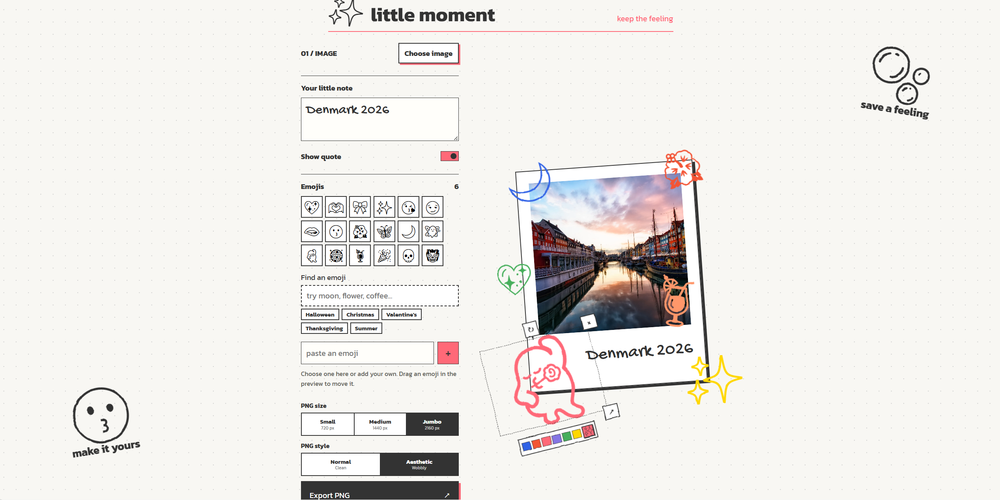

# ✨ Little Moment

**Little Moment** is a browser-only photo-frame editor for turning an image, a handwritten note, and expressive emoji decorations into a shareable PNG.



## Features

- Upload an image and arrange it in a polaroid-style frame
- Add a handwritten note and show or hide it
- Browse, search, or paste emojis
- Drag, resize, rotate, recolor, and remove each emoji directly on the frame
- Use preset swatches or a custom color picker
- Export a high-resolution PNG ready to share
- Works entirely in the browser, with no account or server required

## Quick Start

1. Open [index.html](index.html) in a modern browser, or serve this folder locally.
2. Choose an image.
3. Add and arrange emojis directly on the frame.
4. Add a note if you want one.
5. Select **Export PNG**.

To run a local static server:

```powershell
py -m http.server 4173
```

Then open `http://localhost:4173`.

## 👥 Contribute

Contributions are welcome. Please read [CONTRIBUTING.md](CONTRIBUTING.md) before opening a pull request.

## 📁 Folder Structure

```plaintext
LITTLE_MOMENT/
|
├── assets/
|   └── images/
|       └── little-moment-editor.png
|
├── app.js
├── CONTRIBUTING.md
├── index.html
├── LICENSE
├── styles.css
└── README.md
```

## License

Released under the [MIT License](LICENSE).
